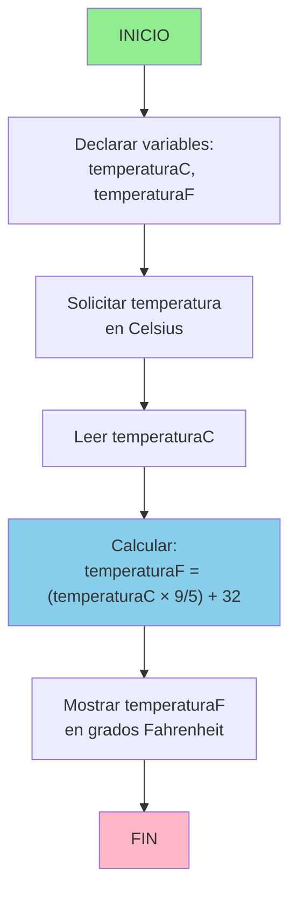

# Conversión de Temperatura: Celsius a Fahrenheit

## PROBLEMA
Diseñar un algoritmo que convierta una temperatura dada en grados Celsius a su equivalente en grados Fahrenheit.

## ANÁLISIS DEL PROBLEMA

### Datos de entrada:
- **temperaturaC** (real): temperatura en grados Celsius ingresada por el usuario

### Datos de salida:
- **temperaturaF** (real): temperatura convertida a grados Fahrenheit

## OBJETIVO DEL ALGORITMO
Aplicar la fórmula de conversión de Celsius a Fahrenheit: **F = (C × 9/5) + 32**, donde C es la temperatura en Celsius y F es el resultado en Fahrenheit.

## PROCESAMIENTO
1. Leer el valor de temperatura en Celsius
2. Aplicar la fórmula de conversión multiplicando por 9/5 y sumando 32
3. Mostrar el resultado en Fahrenheit

## PSEUDOCÓDIGO

```
ALGORITMO ConvertirCelsiusAFahrenheit

VARIABLES:
    temperaturaC : REAL
    temperaturaF : REAL
    
INICIO
    ESCRIBIR "Ingrese la temperatura en grados Celsius: "
    LEER temperaturaC
    
    temperaturaF ← (temperaturaC × 9/5) + 32
    
    ESCRIBIR "La temperatura en Fahrenheit es: ", temperaturaF, "°F"
    
FIN
```

## DIAGRAMA DE FLUJO



## EJEMPLO DE EJECUCIÓN

### Caso 1: Temperatura normal
- **Entrada:** 25°C
- **Cálculo:** (25 × 9/5) + 32 = (25 × 1.8) + 32 = 45 + 32 = 77
- **Salida:** 77°F

### Caso 2: Punto de congelación del agua
- **Entrada:** 0°C
- **Cálculo:** (0 × 9/5) + 32 = 0 + 32 = 32
- **Salida:** 32°F

### Caso 3: Punto de ebullición del agua
- **Entrada:** 100°C
- **Cálculo:** (100 × 9/5) + 32 = 180 + 32 = 212
- **Salida:** 212°F

## CONVERSIÓN INVERSA: DE FAHRENHEIT A CELSIUS

### Objetivo
Aplicar la fórmula inversa para convertir de Fahrenheit a Celsius: **C = (F - 32) × 5/9**.

### Proceso
1. Leer el valor de temperatura en Fahrenheit
2. Usar la fórmula C = (F - 32) × 5/9
3. Mostrar el resultado en Celsius

### Pseudocódigo inverso

```
ALGORITMO ConvertirFahrenheitACelsius

VARIABLES:
    temperaturaF : REAL
    temperaturaC : REAL
    
INICIO
    ESCRIBIR "Ingrese la temperatura en grados Fahrenheit: "
    LEER temperaturaF
    
    temperaturaC ← (temperaturaF - 32) × 5/9
    
    ESCRIBIR "La temperatura en Celsius es: ", temperaturaC, "°C"
    
FIN
```

### Ejemplos

- **Entrada:** 32°F → **Salida:** (32-32)×5/9 = 0°C
- **Entrada:** 212°F → **Salida:** (212-32)×5/9 = 100°C
- **Entrada:** 590°F → **Salida:** (590-32)×5/9 = 310°C

### Diagrama de flujo inverso


## COMPLEJIDAD

- **Complejidad de tiempo:** O(1) - operaciones constantes
- **Complejidad de espacio:** O(1) - usa solo dos variables

## VENTAJAS DEL ALGORITMO

✓ Simple y directo
✓ Utiliza la fórmula matemática estándar
✓ Tiempo de ejecución O(1)
✓ Fácil de implementar en cualquier lenguaje de programación
✓ No requiere estructuras de datos complejas
