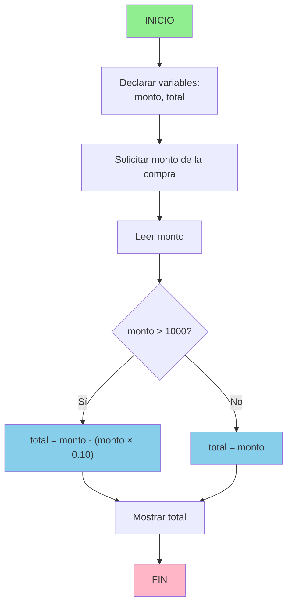

# Cálculo de Descuento en Compra

## PROBLEMA
Elaborar un algoritmo que calcule el total a pagar por una compra, aplicando un 10% de descuento si el monto supera los 1000 pesos.

## ANÁLISIS DEL PROBLEMA

### Datos de entrada:
- **monto** (real): monto total de la compra antes de aplicar descuento

### Datos de salida:
- **total** (real): monto final a pagar después de aplicar o no el descuento

## OBJETIVO DEL ALGORITMO
Determinar si el monto de compra supera los $1000. Si es así, aplicar un descuento del 10%; en caso contrario, el total a pagar es igual al monto original.

## PROCESAMIENTO
1. Leer el monto de la compra
2. Evaluar si el monto es mayor a 1000
    - Si es verdadero: calcular `total = monto - (monto × 0.10)`
    - Si es falso: `total = monto`
3. Mostrar el total a pagar

## PSEUDOCÓDIGO

```
ALGORITMO CalcularTotalConDescuento

VARIABLES:
    monto : REAL
    total : REAL

INICIO
    ESCRIBIR "Ingrese el monto de la compra:"
    LEER monto

    SI monto > 1000 ENTONCES
        total ← monto - (monto × 0.10)
    SINO
        total ← monto
    FIN SI

    ESCRIBIR "El total a pagar es:", total

FIN
```

## DIAGRAMA DE FLUJO



## EJEMPLOS

1. **Entrada:** 1200
   - Descuento: 1200 × 0.10 = 120
   - **Salida:** 1080

2. **Entrada:** 800
   - No aplica descuento
   - **Salida:** 800

3. **Entrada:** 1000
   - No supera 1000 → sin descuento
   - **Salida:** 1000

## COMPLEJIDAD

- **Tiempo:** O(1)
- **Espacio:** O(1)

## NOTAS
- El algoritmo es apropiado para implementarse en cualquier lenguaje de programación.
- El umbral de $1000 puede modificarse según requerimientos futuros.
