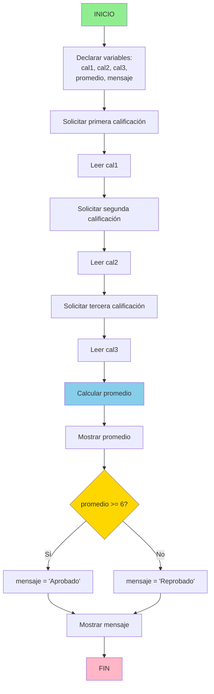

# Promedio de Calificaciones y Estado del Estudiante

## PROBLEMA
Diseñar un algoritmo que reciba tres calificaciones numéricas y determine el promedio final del estudiante. Además, debe mostrar un mensaje indicando si el estudiante aprobó o reprobó, considerando que la calificación mínima aprobatoria es 6.

## ANÁLISIS DEL PROBLEMA

### Datos de entrada:
- **cal1** (real): primera calificación
- **cal2** (real): segunda calificación
- **cal3** (real): tercera calificación

### Datos de salida:
- **promedio** (real): promedio de las tres calificaciones
- **mensaje** (cadena): "Aprobado" si promedio ≥ 6, "Reprobado" en caso contrario

## OBJETIVO DEL ALGORITMO
Calcular el promedio de tres calificaciones usando la fórmula:

```
promedio = (cal1 + cal2 + cal3) / 3
```

Luego, determinar si el estudiante aprobó (promedio ≥ 6) o reprobó (promedio < 6).

## PROCESAMIENTO
1. Leer las tres calificaciones
2. Calcular el promedio sumando las tres calificaciones y dividiendo entre 3
3. Mostrar el promedio calculado
4. Evaluar si el promedio es mayor o igual a 6
    - Si es verdadero: mostrar "Aprobado"
    - Si es falso: mostrar "Reprobado"

## PSEUDOCÓDIGO

```
ALGORITMO PromedioCalificaciones

VARIABLES:
    cal1, cal2, cal3 : REAL
    promedio : REAL
    mensaje : CADENA

INICIO
    ESCRIBIR "Ingrese la primera calificación:"
    LEER cal1
    ESCRIBIR "Ingrese la segunda calificación:"
    LEER cal2
    ESCRIBIR "Ingrese la tercera calificación:"
    LEER cal3

    promedio ← (cal1 + cal2 + cal3) / 3
    ESCRIBIR "El promedio es:", promedio

    SI promedio >= 6 ENTONCES
        mensaje ← "Aprobado"
    SINO
        mensaje ← "Reprobado"
    FIN SI

    ESCRIBIR mensaje

FIN
```

## DIAGRAMA DE FLUJO



## EJEMPLOS

- Entrada: 7, 8, 9 → Promedio 8 → Aprobado
- Entrada: 5, 6, 7 → Promedio 6 → Aprobado
- Entrada: 3, 4, 5 → Promedio 4 → Reprobado

## COMPLEJIDAD

- **Tiempo:** O(1)
- **Espacio:** O(1)


## NOTAS
- El umbral de aprobación (6) puede ajustarse según el sistema de notas requerido.
- Este algoritmo es adecuado para implementarse en cualquier lenguaje de programación.
